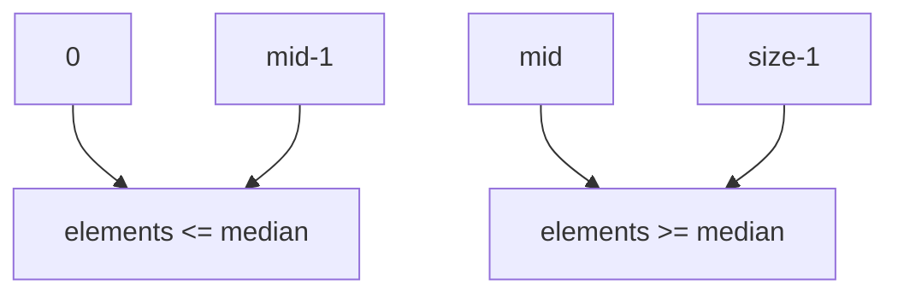
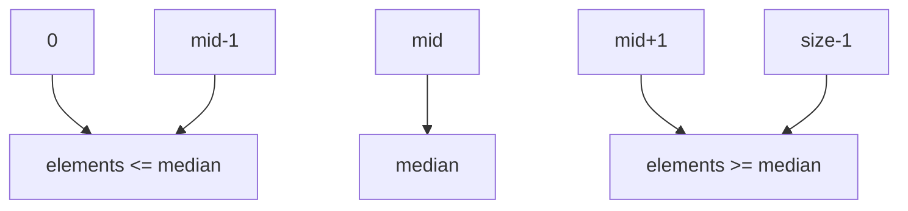

<h1>The&nbsp;&nbsp;&nbsp;New&nbsp;&nbsp;&nbsp;Note&nbsp;&nbsp;&nbsp;Of&nbsp;&nbsp;&nbsp;Chapter 03

## Vector

Analogous to the list in Python. We can get every element of every vector by index, and the index of every element must be integer. And there is one import thing is that we are mustn't use index which is negative number.

If the size of one vector is even, then the vector will assigned to two part. And there is one mid element in each side. just like that picture below.

But if it's odd, that will be another story, like this picture below.

