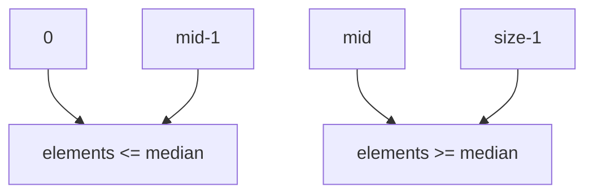
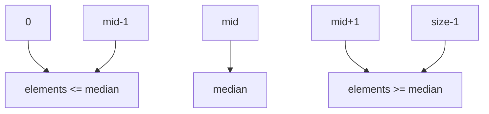

<h1>The&nbsp;&nbsp;&nbsp;New&nbsp;&nbsp;&nbsp;Note&nbsp;&nbsp;&nbsp;Of&nbsp;&nbsp;&nbsp;Chapter 03

## Vector

Analogous to the list in Python. We can get every element of every vector by index, and the index of every element must be integer. And there is one import thing is that we are mustn't use index which is negative number.

If the size of one vector is even, then the vector will assigned to two part. And there is one mid element in each side. just like that picture below.

But if it's odd, that will be another story, like this picture below.

## Details

- If we define a variable but without an explicit initializer, it means that the value of this variable is undefined.
- We can use `typedef` to rename a type, and that new type which have new name has the same function with the old type.
- The `vector` type is defined in `<vector>` , it's very similar to `list` which is useful type in Python. We can define a  `vector` like `vector<Type> vector_name`, then wen can use the member function of the vector which is defined just now.
  - `vector<T>::size_type `A type guaranteed to be able to hold the number of elements in the largest possible vector .
  - `v.begin()`,`v.end() ` To get the first (last) element of a vector which is name v. 
  - `v.push_back(e)` To append a element which is named e to the last of the vector.
  - `v.size()` To know how many elements in the vector.
  - `v[i]` To get the element whose index is i.
- `sort(b, e) ` Rearranges the elements defined by the range [b, e) into nondecreasing order. Defined in `<algorithm>`. 